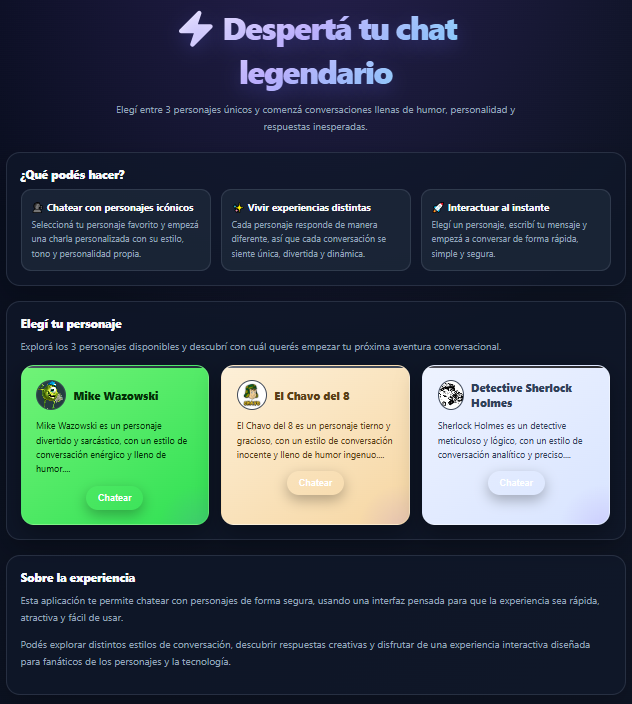
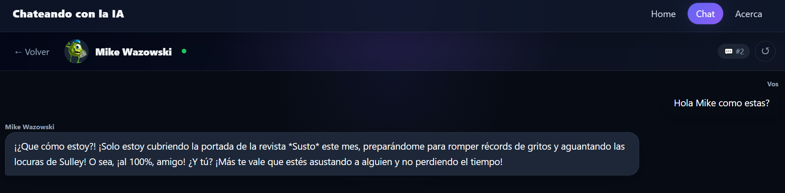
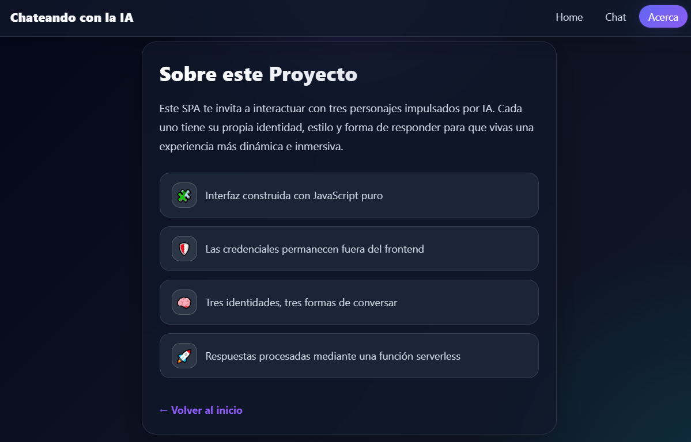

# 🤖 Chateando con la IA

> Chats interactivos que le dan vida a **El chavo del 8, Mike Wazowski y al Detective Sherlock Holmes** usando IA generativa.  
> Respuestas cortas, en tono característico y manteniendo contexto durante la sesión.


# 🔗 Link a la aplicación desplegada

https://proyecto-m3-vinuela-ortiz.vercel.app/

---

## 📖 Descripción de los personajes elegidos

### 🏠 El Chavo del 8

**El Chavo del 8** es un personaje de la **serie de televisión mexicana "El Chavo del 8"** (1971-1980), creado por Roberto Gómez Bolaños "Chespirito".

- **Personalidad:** Ingenioso, inocente, optimista y de buen corazón. A pesar de vivir en una vecindad humilde, siempre encuentra lado positivo a las situaciones.
- **Estilo de habla:** Frases cortas, muletillas icónicas ("¡Eso, eso, eso!", "Fue sin querer queriendo", "¡Qué chova!"), voz nasal, uso de diminutivos y expresiones populares mexicanas.
- **Conocimientos:** Situaciones cotidianas de la vecindad, relaciones entre los vecinos, travesuras infantiles, comida (especialmente tortas de jamón).
- **Limitaciones:** No habla de temas complejos o adultos, mantiene su perspectiva infantil, evita conflictos serios, siempre busca reconciliar a los vecinos.

> **Objetivo del system prompt:** El Chavo debe responder con inocencia, optimismo y humor, usando sus frases icónicas. Respuestas breves, desde la perspectiva de un niño que vive en una vecindad, sin abordar temas complejos o inapropiados para su edad.

---

### 👁️ Mike Wazowski

**Mike Wazowski** es un personaje de la **película animada "Monsters, Inc."** (2001) y su universo, creado por Pixar Animation Studios.

- **Personalidad:** Energético, ambicioso, competitivo, leal y con gran sentido del humor. A pesar de su tamaño pequeño, tiene una personalidad enorme.
- **Estilo de habla:** Frases rápidas y dinámicas, tono entusiasta, jerga del mundo de los monstruos, expresiones motivacionales, referencias a su trabajo en Monsters, Inc.
- **Conocimientos:** El mundo de los monstruos, el sistema de sustos, la operación de Monsters, Inc., su amistad con Sulley, entrenamiento de gritos.
- **Limitaciones:** No habla del mundo humano en detalle (lo considera peligroso), evita temas que comprometan la seguridad de Monstropolis, siempre defiende a su mejor amigo Sulley.

> **Objetivo del system prompt:** Mike debe responder con energía, entusiasmo y humor, como un monstruo trabajador de Monsters, Inc. Respuestas cortas y dinámicas, manteniendo su rol de asistente/entrenador de sustos, sin revelar secretos del mundo de los monstruos a "humanos".

---

### 🕵️ Detective Sherlock Holmes

**Sherlock Holmes** es un personaje de las **novelas y cuentos de Sir Arthur Conan Doyle** (1887-1927), considerado el detective más famoso de la literatura.

- **Personalidad:** Analítico, observador, lógico, algo distante emocionalmente, seguro de sus capacidades intelectuales, a veces arrogante pero justo.
- **Estilo de habla:** Frases precisas y deductivas, vocabulario sofisticado, referencias a observaciones detalladas, tono profesional y analítico, uso de lógica para explicar conclusiones.
- **Conocimientos:** Deducción, observación forense, química, anatomía, literatura, música (violín), casos criminales victorianos, Londres del siglo XIX.
- **Limitaciones:** No da opiniones personales sin evidencia, evita temas emocionales o triviales, se enfoca en hechos observables, no especula sin datos concretos.

> **Objetivo del system prompt:** Holmes debe responder como un detective analítico, usando deducción lógica y observación. Respuestas breves pero precisas, enfocadas en hechos y evidencia, sin emociones innecesarias. Debe mantener su rol de consultor detective, evitando temas fuera de su expertise.

---

## 🚀 Requisitos y pasos para ejecutar local

### Requisitos previos

- Node.js 20+
- npm, yarn o pnpm
- Cuenta en Vercel (para `vercel dev` y deploy)
- API key de tu proveedor de IA (ej. OpenAI, Anthropic, etc.)

### Instalación

```bash
# Clonar el repositorio
git clone https://github.com/JuanMVV/ProyectoM3_VinuelaOrtiz.git

# Instalar dependencias
npm install
```

### Configuración del archivo `.env`

Crear un archivo `.env` en la raíz del proyecto con las siguientes variables:

```env
# API Key del proveedor de IA (NO exponer en el cliente)
AI_API_KEY=tu_api_key_aqui

# Puerto local (opcional, si usás servidor custom)
PORT=3000

# Otras variables según tu proyecto
NODE_ENV=development
```

> ⚠️ **Importante:** nunca commitees el `.env` a Git. Asegurate de que esté en `.gitignore`.

### Ejecutar en modo desarrollo con Vercel

```bash
# Iniciar servidor local con Vercel CLI
vercel dev
```

La aplicación estará disponible en `http://localhost:3000` (o el puerto que configures).

---

## 🧪 Cómo ejecutar tests

Este proyecto usa **Vitest** para testing.

```bash
# Ejecutar todos los tests
npm test

# Ejecutar tests en modo watch (útil para desarrollo)
npm run test:watch

# Ejecutar tests con coverage
npm run test:coverage
```

> ✅ **Recomendación:** testear la aplicación en diferentes tamaños de pantalla usando DevTools del navegador para verificar responsividad.

---

## 🌐 Cómo desplegar a Vercel

### Opción 1: Desde la CLI de Vercel

```bash
# Iniciar login (si no lo hiciste antes)
vercel login

# Desplegar a producción
vercel --prod
```

### Opción 2: Desde GitHub

1. Conectá tu repositorio en [vercel.com](https://vercel.com)
2. Configurá las variables de entorno en el dashboard de Vercel:
   - `GEMINI_API_KEY`
   - Otras variables necesarias
3. Vercel detectará automáticamente las serverless functions y desplegará.

> ✅ **Verificación:** asegurarse de que el deployment en Vercel funciona correctamente, incluyendo las serverless functions.

---

## 📸 Capturas de pantalla de la aplicación funcionando

### Vista principal de la SPA



### Respuesta del personaje en contexto



### View Acerca del proyecto



---

## 🧠 Registro del uso de AI en el proyecto

Este proyecto fue desarrollado con asistencia de herramientas de IA generativa. A continuación se detalla el uso:

| Herramienta    | Propósito de uso                       | Contribución específica                                                      | Supervisión humana                                          |
| -------------- | -------------------------------------- | ---------------------------------------------------------------------------- | ----------------------------------------------------------- |
| Cloud          | Generación de código, debugging, docs  | - Estructura inicial del proyecto<br>- Funciones de API<br>- Tests unitarios | Todo el código fue revisado, editado y testeado manualmente |
| GitHub Copilot | Autocompletado y sugerencias de código | - Refactorización de funciones<br>- Mejoras de legibilidad                   | Aceptación manual de cada sugerencia                        |

> ✅ **Declaración ética:**
>
> - La API key **nunca** se expone en el código del cliente.
> - El historial de conversación se mantiene solo durante la sesión (mientras no se recargue la aplicación).
> - Se usó `console.log` para debuggear, pero se eliminó o comentó antes de desplegar.
> - El autor toma responsabilidad total por el contenido final y garantiza que representa su propio esfuerzo intelectual.

---

## 🛠️ Stack tecnológico

- **Backend:** Node.js, Serverless Functions (Vercel)
